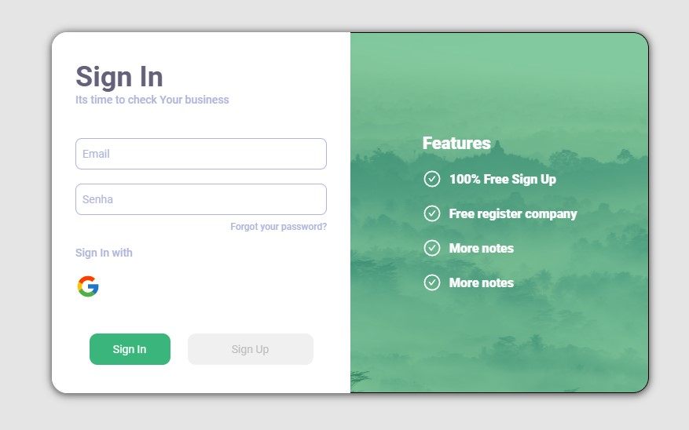

# My Personal Finance

<h1>  </h1>

## <a href="https://google.com">See the Site</a>
<br>

## 📕 About
<br>

Personal finance system for cash flow control and management
<br>
<br>


## 🔨 Tools

- ReactJS
- Styled-components
- React-Hook-Form
- Node
- MySQL
- Yup
- Axios
<br>
<br>

## 🔨 Progress

- [x] Login
- [ ] Dashboard
- [ ] API CRUD
- [ ] DB MySQL

## How Clone Projects
<br>

```bash 
#Clone the project
$git clone https://github.com/RafaelPires2/myPersonalFinance.git
```

```bash 
#enter directory
$ cd myPersonalFinance
```

```bash 
#enter install the dependencies, if use npm
$ npm install
```
<p align="center">Or</p>

```bash 
#enter install the dependencies, if use yarn
$ yarn
```
<br>

## 📄 License
<br>

This project is under the MIT license. See the LICENSE file for details. [LICENSE](https://docs.github.com/pt/repositories/managing-your-repositorys-settings-and-features/customizing-your-repository/licensing-a-repository)
